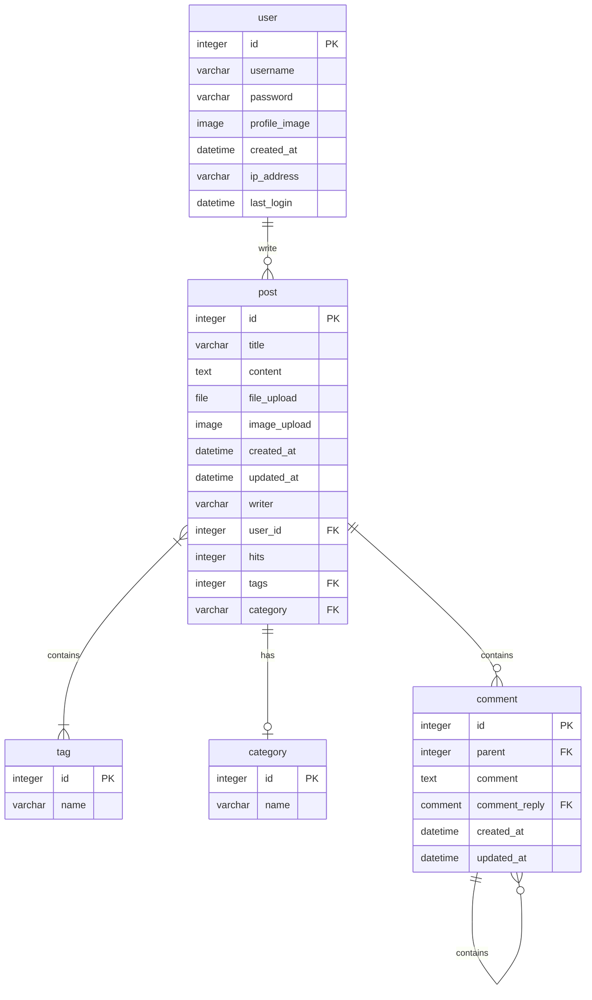
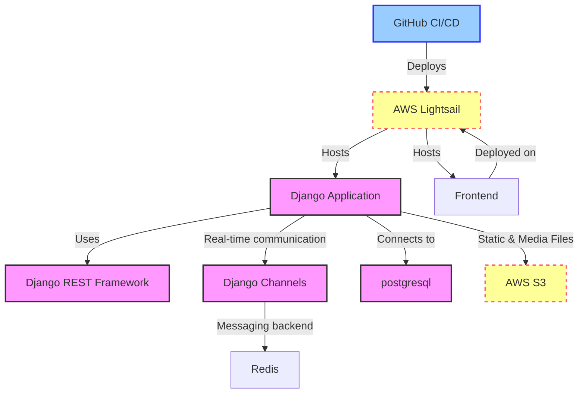

# AI 기반 DDoS 공격 탐지 프로젝트: aDDoS

## 1. 목표와 기능

### 1.1 목표
- AI분석을 통한 분산 서비스 거부공격(DDoS) 분류
- "5분이내 탐지 30분 이내 대응"을 실현하기 위한 이메일 알림 시스템 구축

### 1.2 기능
- IP, 계정 별 실시간 트래픽량 확인 (그래프형식, 대시보드)
- Suricata Rule 편집의 간소화 (Web Dashboard에서 편집 후 적용)

### 1.3 역할 분담

- 팀장 : 이두리
- FE : 이라규, 이건우
- BE : 박주형, 송경선, 이두리
- 디자인 : 이라규

## 2. 개발 환경 및 배포 URL
### 2.1 개발 환경
- Web Framework
  - Django 4.1.13 (Python 3.10.5)
  - bootstrap 5.3.3
  - next 14.1.4
  - 
- 서비스 배포 환경
  - kafka 버전:       3.7.1
  - Scala 버전:       2.13
  - Suricata        7.0.6
  - openjdk       11.0.24
  - filebeat        8.10.1
  - elasticsearch    7.17.23

### 2.2 URL 구조(마이크로식)

* aDDoS

|app:account|HTTP Method|설명|엔드포인트|요청 파라미터|
|:-|:-|:-|:-|:-|
|signin/|POST|회원가입|/signin/api/signup/|email,password,ip_address|
|login/|POST|로그인|/signin/api/login/|email,password|
|mypage/|GET|마이페이지 조회|/signin/api/mypage/|인증 토큰
|mypage/|PUT|마이페이지 수정|/signin/api/mypage/|인증토큰,ip_address,password|

## 3. 프로젝트 구조와 개발 일정
### 3.1 프로젝트 구조
- Django

📦aDDoS 
 ┣ 📂account
 ┃ ┣ 📂__pycache__
 ┃ ┃ ┣ 📜__init__.cpython-310.pyc
 ┃ ┃ ┣ 📜settings.cpython-310.pyc
 ┃ ┃ ┣ 📜urls.cpython-310.pyc
 ┃ ┃ ┗ 📜wsgi.cpython-310.pyc
 ┃ ┣ 📜__init__.py
 ┃ ┣ 📜asgi.py
 ┃ ┣ 📜settings.py
 ┃ ┣ 📜urls.py
 ┃ ┗ 📜wsgi.py
 ┣ 📂signin
 ┃ ┣ 📂__pycache__
 ┃ ┃ ┣ 📜__init__.cpython-310.pyc
 ┃ ┃ ┣ 📜admin.cpython-310.pyc
 ┃ ┃ ┣ 📜apps.cpython-310.pyc
 ┃ ┃ ┣ 📜forms.cpython-310.pyc
 ┃ ┃ ┣ 📜models.cpython-310.pyc
 ┃ ┃ ┣ 📜urls.cpython-310.pyc
 ┃ ┃ ┗ 📜views.cpython-310.pyc
 ┃ ┣ 📂migrations
 ┃ ┃ ┣ 📂__pycache__
 ┃ ┃ ┃ ┣ 📜0001_initial.cpython-310.pyc
 ┃ ┃ ┃ ┗ 📜__init__.cpython-310.pyc
 ┃ ┃ ┣ 📜0001_initial.py
 ┃ ┃ ┗ 📜__init__.py
 ┃ ┣ 📜__init__.py
 ┃ ┣ 📜admin.py
 ┃ ┣ 📜apps.py
 ┃ ┣ 📜forms.py
 ┃ ┣ 📜models.py
 ┃ ┣ 📜tests.py
 ┃ ┣ 📜urls.py
 ┃ ┗ 📜views.py
 ┣ 📂templates
 ┃ ┣ 📂signin
 ┃ ┃ ┣ 📜login.html
 ┃ ┃ ┗ 📜signup.html
 ┃ ┗ 📜base_generic.html
 ┗ 📜manage.py

## 5. 화면 설계
- 업데이트 예정
 
<table>
    <tbody>
        <tr>
            <td>메인</td>
            <td>로그인</td>
        </tr>
        <tr>
            <td>
		
            </td>
            <td>
                
            </td>
        </tr>
        <tr>
            <td>회원가입</td>
            <td>정보수정</td>
        </tr>
        <tr>
            <td>
                
            </td>
            <td>
                
            </td>
        </tr>
        <tr>
            <td>검색</td>
            <td>번역</td>
        </tr>
        <tr>
            <td>
                
            </td>
            <td>
                
            </td>
        </tr>
        <tr>
            <td>선택삭제</td>
            <td>글쓰기</td>
        </tr>
        <tr>
            <td>
	        
            </td>
            <td>
                
            </td>
        </tr>
        <tr>
            <td>글 상세보기</td>
            <td>댓글</td>
        </tr>
        <tr>
            <td>
                
            </td>
            <td>
                
            </td>
        </tr>
    </tbody>
</table>

## 6. 데이터베이스 모델링(ERD)

* 아래 ERD는 머메이드를 사용했습니다.

* 아래 ERD는 [ERDCloud](https://www.erdcloud.com/)를 사용했습니다.

* https://dbdiagram.io/home도 많이 사용합니다.

## 7. Architecture

* 아래 Architecture 설계도는 ChatGPT에게 아키텍처를 설명하고 mermaid로 그려달라 요청한 것입니다.

## 8. 개발 후기
 

- 추후 업데이트 예정
